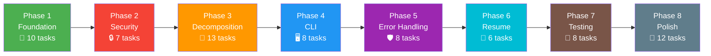

# 📋 แผนดำเนินงาน (Execution Plan) — Uwufufu-Automator Refactoring

> **วันที่**: 6 มิถุนายน 2026  
> **ผู้ดำเนินการ**: `custapq`  
> **Repo ต้นทาง**: [ASVPATM/Uwufufu-Automator](https://github.com/ASVPATM/Uwufufu-Automator)

---

## 🔀 PR vs Fork — ควรทำแบบไหน?

### ข้อมูลที่ตรวจสอบแล้ว

| รายการ | ค่า |
|--------|-----|
| Repo owner | `ASVPATM` |
| Git user ปัจจุบัน (คุณ) | `custapq` |
| คุณเป็นเจ้าของ repo? | ❌ ไม่ใช่ |
| จำนวน commits | 3 (โปรเจคเริ่มต้น) |
| Branches | `main` อย่างเดียว |
| ขนาดการเปลี่ยนแปลง | **ใหญ่มาก** — เปลี่ยนโครงสร้างทั้งโปรเจค |

### ✅ คำแนะนำ: **Fork มาทำเป็นของตัวเอง**

เหตุผล:

| เหตุผล | รายละเอียด |
|--------|-----------|
| **1. ไม่ใช่เจ้าของ repo** | คุณคือ `custapq` แต่ repo เป็นของ `ASVPATM` — ไม่มีสิทธิ์ push โดยตรง |
| **2. การเปลี่ยนแปลงใหญ่เกินไปสำหรับ PR** | Refactoring ทั้งหมดเปลี่ยนโครงสร้างโปรเจคแบบหัวรากถอน (1 ไฟล์ → 10+ ไฟล์) — PR แบบนี้แทบไม่มีใคร review/merge |
| **3. เจ้าของอาจไม่ active** | Repo มีแค่ 3 commits ไม่มี issues/releases — โอกาสที่ PR จะถูก review ต่ำ |
| **4. Vision ต่างกัน** | คุณอาจต้องการเพิ่ม feature หรือเปลี่ยน architecture ที่เจ้าของไม่ได้ต้องการ |

### 📝 ขั้นตอน Fork

```bash
# 1. Fork ผ่าน GitHub UI (กดปุ่ม Fork บนหน้า repo)
#    → จะได้ https://github.com/custapq/Uwufufu-Automator

# 2. เปลี่ยน remote ให้ชี้ไป fork ของตัวเอง
git remote rename origin upstream
git remote add origin https://github.com/custapq/Uwufufu-Automator.git

# 3. ตรวจสอบ
git remote -v
# origin    https://github.com/custapq/Uwufufu-Automator.git (fetch)
# origin    https://github.com/custapq/Uwufufu-Automator.git (push)
# upstream  https://github.com/ASVPATM/Uwufufu-Automator.git (fetch)
# upstream  https://github.com/ASVPATM/Uwufufu-Automator.git (push)

# 4. Push ไป fork ของตัวเอง
git push origin main
```

> [!TIP]
> **ทำ PR กลับ upstream ได้ทีหลัง** — ถ้าอยากให้เจ้าของ repo ได้ประโยชน์จากการปรับปรุง  
> แนะนำส่ง PR เฉพาะ Phase ที่เล็กและ self-contained (เช่น Phase 1 หรือ 2) ไม่ใช่ทั้งหมดในครั้งเดียว

### หลักการ Branch สำหรับ Fork ของคุณ

```
main                          ← stable, ใช้งานได้เสมอ
├── phase/1-project-structure  ← แยก branch ตาม phase
├── phase/2-security
├── phase/3-decomposition
├── phase/4-cli
├── phase/5-error-handling
├── phase/6-resume
├── phase/7-testing
└── phase/8-fixes
```

**วิธีทำงานแต่ละ Phase:**
1. สร้าง branch จาก `main`
2. ทำงานใน branch นั้น
3. เสร็จแล้ว merge กลับ `main`
4. ทำ Phase ถัดไป

---

## 🗓️ Phase 1: โครงสร้างโปรเจค (Foundation)

> **Branch**: `phase/1-project-structure`  
> **เป้าหมาย**: วางรากฐาน — สร้างไฟล์ใหม่ทั้งหมดโดยยังไม่ย้ายโค้ด  
> **ผลลัพธ์**: โปรเจคมีโครงสร้าง module ใหม่ แต่ `auto_uwu.py` ยังทำงานเหมือนเดิม

### Tasks

- [ ] **1.1** สร้างโครงสร้าง directory
  ```
  src/__init__.py
  src/utils/__init__.py
  tests/__init__.py
  ```

- [ ] **1.2** สร้าง `requirements.txt`
  ```
  selenium>=4.0.0
  requests>=2.28.0
  python-dotenv>=1.0.0
  pyyaml>=6.0
  ```

- [ ] **1.3** สร้าง `requirements-dev.txt`
  ```
  pytest>=7.0.0
  pytest-cov>=4.0.0
  pytest-mock>=3.10.0
  ```

- [ ] **1.4** สร้าง `.gitignore`
  ```
  .env
  config.yaml
  spotify_to_youtube.txt
  spotify_to_youtube.json
  logs/
  __pycache__/
  *.pyc
  .pytest_cache/
  output/
  ```

- [ ] **1.5** สร้าง `.env.example`
  ```ini
  UWUFUFU_EMAIL=your_email@example.com
  UWUFUFU_PASSWORD=your_password
  SPOTIFY_PLAYLIST_URL=https://open.spotify.com/playlist/xxxxx
  ```

- [ ] **1.6** สร้าง `src/models.py` — Data classes (`Track`, `YoutubeLink`, `GameConfig`, `Credentials`)

- [ ] **1.7** สร้าง `src/config.py` — `AppConfig`, `TimingConfig`, `SelectorConfig`, `load_config()`

- [ ] **1.8** สร้าง `src/exceptions.py` — Custom exceptions

- [ ] **1.9** ตรวจสอบว่า `auto_uwu.py` ยังทำงานได้ปกติ (ไม่ได้แก้ไข)

- [ ] **1.10** Commit + push

### Checklist ก่อน merge
- [ ] `python src/auto_uwu.py` ยังรันได้
- [ ] `python -c "from src.models import Track; print(Track('test','artist'))"` ทำงาน
- [ ] `python -c "from src.config import AppConfig; print(AppConfig())"` ทำงาน
- [ ] `.gitignore` ไม่มีไฟล์ sensitive ถูก track

---

## 🔒 Phase 2: ความปลอดภัย (Security)

> **Branch**: `phase/2-security`  
> **เป้าหมาย**: แก้ปัญหา password plain text + เพิ่ม .env support  
> **ผลลัพธ์**: รหัสผ่านไม่แสดงใน terminal, สามารถใช้ .env ได้

### Tasks

- [ ] **2.1** เพิ่ม `getpass` ใน `get_user_credentials()`
  ```python
  import getpass
  uwu_password = getpass.getpass("Enter your UwuFufu password: ")
  ```

- [ ] **2.2** เพิ่มฟังก์ชัน `load_credentials_from_env()` ใน `config.py`
  - โหลดจาก `.env` ถ้ามี
  - Fallback เป็น interactive input ถ้าไม่มี

- [ ] **2.3** อัปเดต `get_user_credentials()` ให้ลองอ่านจาก env ก่อน
  ```python
  def get_user_credentials():
      creds = load_credentials_from_env()
      if creds:
          print("✅ Loaded credentials from .env")
          return creds
      # fallback to interactive...
  ```

- [ ] **2.4** ทดสอบ: รันโดยไม่มี `.env` → ถาม interactive (password ซ่อน)

- [ ] **2.5** ทดสอบ: สร้าง `.env` → โหลดอัตโนมัติ

- [ ] **2.6** ตรวจว่า `.env` ไม่ถูก commit (อยู่ใน `.gitignore`)

- [ ] **2.7** Commit + push

### Checklist ก่อน merge
- [ ] `getpass` ทำงาน — พิมพ์รหัสผ่านไม่เห็นใน terminal
- [ ] `.env` ถูก gitignore
- [ ] `.env.example` มีอยู่ใน repo (ค่าตัวอย่าง ไม่มี credentials จริง)

---

## 🧩 Phase 3: แยก God Function (Decomposition) — ส่วนที่ใหญ่ที่สุด

> **Branch**: `phase/3-decomposition`  
> **เป้าหมาย**: แยกไฟล์เดียว 1,121 บรรทัดออกเป็น modules  
> **ผลลัพธ์**: แต่ละ module ทำหน้าที่เดียว ทดสอบแยกได้

### Tasks

- [ ] **3.1** สร้าง `src/utils/browser.py`
  - `create_driver(headless, window_size)` — WebDriver factory
  - `find_element_with_fallback(driver, strategies)` — ค้นหา element หลายวิธี
  - `managed_browser()` — context manager

- [ ] **3.2** สร้าง `src/utils/logger.py`
  - `setup_logger(name, log_dir, level)` — สร้าง logger
  - ส่งออกทั้ง console + file

- [ ] **3.3** สร้าง `src/utils/retry.py`
  - `@retry` decorator พร้อม exponential backoff

- [ ] **3.4** สร้าง `src/spotify_scraper.py`
  - ย้ายฟังก์ชัน `get_spotify_playlist_tracks_without_api()` มาเป็น class `SpotifyScraper`
  - แยกเป็น methods: `get_tracks()`, `_wait_for_tracklist()`, `_get_expected_track_count()`, `_scroll_to_load_all()`, `_extract_tracks_js()`, `_extract_tracks_selenium()`
  - ใช้ `Track` model แทน dict
  - แทน `print()` ด้วย `logger`

- [ ] **3.5** ทดสอบ `SpotifyScraper` แยก — รัน scrape playlist จริงสัก 1 อัน

- [ ] **3.6** สร้าง `src/youtube_searcher.py`
  - ย้ายฟังก์ชัน `search_youtube_without_api()` + `create_youtube_links_file()` มาเป็น class `YouTubeSearcher`
  - แยกเป็น methods: `search()`, `search_all()`
  - ใช้ `requests.Session()` (reuse connection)
  - ใช้ `YoutubeLink` model แทน dict
  - เพิ่ม `@retry` decorator
  - แก้ regex: `\S{11}` → `[A-Za-z0-9_-]{11}`

- [ ] **3.7** ทดสอบ `YouTubeSearcher` แยก — ค้นหาเพลงสัก 3 เพลง

- [ ] **3.8** สร้าง `src/uwufufu_automator.py`
  - ย้าย `create_and_automate_uwufufu()` มาเป็น class `UwuFufuAutomator`
  - แยก methods:
    - `login(credentials)` — ล็อกอิน
    - `navigate_to_create_game()` — ไปหน้าสร้างเกม (รวม fallback 4 ชั้น)
    - `fill_game_details(game)` — กรอก title + description
    - `open_choices_panel()` — เปิด panel
    - `reveal_video_input()` — กดปุ่ม video
    - `add_video(link)` — เพิ่ม video 1 ตัว
    - `add_all_videos(links)` — เพิ่มทั้งหมด
  - Private methods สำหรับ fallback: `_try_*_by_selector()`, `_try_*_by_text()`, `_try_*_by_javascript()`, `_try_*_by_direct_navigation()`

- [ ] **3.9** สร้าง `src/file_manager.py`
  - `save_youtube_links(links, path)` — บันทึก JSON + text
  - `load_youtube_links(path)` — โหลดจาก JSON

- [ ] **3.10** อัปเดต `src/main.py` — entry point ใหม่ที่ใช้ class ทั้งหมด
  ```python
  def main():
      config = load_config()
      logger = setup_logger()
      credentials = get_user_credentials()
      
      with managed_browser() as driver:
          scraper = SpotifyScraper(driver, config)
          tracks = scraper.get_tracks(credentials.spotify_url)
      
      searcher = YouTubeSearcher(config)
      youtube_links = searcher.search_all(tracks)
      save_youtube_links(youtube_links, config.output_file)
      
      valid = [l for l in youtube_links if l.is_valid]
      
      with managed_browser() as driver:
          automator = UwuFufuAutomator(driver, config)
          automator.login(credentials)
          automator.navigate_to_create_game()
          automator.fill_game_details(credentials.game)
          automator.open_choices_panel()
          automator.reveal_video_input()
          automator.add_all_videos(valid)
  ```

- [ ] **3.11** ทดสอบ end-to-end — รันทั้ง flow ผ่าน `main.py`

- [ ] **3.12** ลบ/rename `auto_uwu.py` เดิม (หรือเก็บไว้เทียบ)

- [ ] **3.13** Commit + push

### Checklist ก่อน merge
- [ ] `python src/main.py` ทำงานได้ครบ flow
- [ ] แต่ละ class import แยกได้โดยไม่ error
- [ ] ไม่มี `print()` เหลือ (ใช้ `logger` หมด)
- [ ] ไม่มี bare `except:` เหลือ
- [ ] Log file ถูกสร้างใน `logs/`

---

## 🖥️ Phase 4: CLI Interface

> **Branch**: `phase/4-cli`  
> **เป้าหมาย**: ผู้ใช้สั่งงานผ่าน command line arguments ได้  
> **ผลลัพธ์**: รองรับ `--headless`, `--spotify-only`, `--resume`, etc.

### Tasks

- [ ] **4.1** เพิ่ม `argparse` ใน `main.py`
  - `--spotify-url` — URL ของ playlist
  - `--email` — UwuFufu email
  - `--title` — ชื่อเกม
  - `--description` — คำอธิบายเกม
  - `--headless` — รัน browser แบบไม่แสดงจอ
  - `--use-env` — โหลด credentials จาก `.env`
  - `--spotify-only` — ดึงแค่เพลง + YouTube links (ไม่ทำ UwuFufu)
  - `--resume <file>` — ข้าม Spotify+YouTube โหลดจาก JSON
  - `--output <file>` — กำหนด output file
  - `--config <file>` — กำหนด config file
  - `--verbose / -v` — debug logging

- [ ] **4.2** ปรับ `main()` ให้ใช้ args ร่วมกับ interactive fallback
  ```
  ถ้ามี --email → ใช้ค่านั้น
  ถ้ามี --use-env → โหลดจาก .env
  ถ้าไม่มีทั้งสอง → ถาม interactive
  ```

- [ ] **4.3** Implement `--spotify-only` mode
  - รัน Spotify scrape + YouTube search แล้วหยุด
  - ไม่ต้องถาม UwuFufu credentials

- [ ] **4.4** Implement `--resume` mode
  - อ่าน YouTube links จาก JSON file
  - ข้ามขั้น Spotify + YouTube search
  - ไปที่ UwuFufu automation โดยตรง

- [ ] **4.5** Implement `--headless` mode
  - ส่งค่าให้ `create_driver(headless=True)`

- [ ] **4.6** ทดสอบทุก CLI combination ที่สำคัญ:
  - `python src/main.py` (fully interactive)
  - `python src/main.py --spotify-only --spotify-url "..."`
  - `python src/main.py --resume output.json --email "..." --title "..."`
  - `python src/main.py --use-env --headless`
  - `python src/main.py -v` (verbose)

- [ ] **4.7** อัปเดต `README.md` — เพิ่มตัวอย่าง CLI usage

- [ ] **4.8** Commit + push

### Checklist ก่อน merge
- [ ] `python src/main.py --help` แสดง usage ถูกต้อง
- [ ] ทุก flag ทำงานตามที่ระบุ
- [ ] Interactive mode ยังใช้ได้เหมือนเดิม (backward compatible)

---

## 🛡️ Phase 5: Error Handling

> **Branch**: `phase/5-error-handling`  
> **เป้าหมาย**: กำจัด bare except + ใช้ custom exceptions  
> **ผลลัพธ์**: Error messages ชัดเจน, debug ง่าย, มี log file

### Tasks

- [ ] **5.1** สแกนหา bare `except:` ทั้งหมดในโค้ด
  ```bash
  grep -n "except:" src/*.py src/utils/*.py
  ```

- [ ] **5.2** แก้ทุก bare `except:` ให้ระบุ exception type ชัดเจน
  ```python
  # ❌ except:
  # ✅ except (NoSuchElementException, ElementNotInteractableException) as e:
  ```

- [ ] **5.3** ใช้ custom exceptions จาก `exceptions.py` ในจุดสำคัญ
  - `LoginError` — login ล้มเหลว
  - `GameCreationError` — สร้างเกมไม่ได้
  - `ElementNotFoundError` — หา element ไม่เจอหลัง fallback หมด
  - `SpotifyScrapingError` — Spotify scrape ล้มเหลว

- [ ] **5.4** เพิ่ม try/except ใน `main()` ที่จับ custom exceptions แยก
  ```python
  try:
      ...
  except LoginError:
      logger.error("❌ ล็อกอินไม่สำเร็จ ตรวจสอบ email/password")
  except SpotifyScrapingError:
      logger.error("❌ ดึง Spotify playlist ไม่ได้")
  except GameCreationError:
      logger.error("❌ สร้างเกมไม่สำเร็จ")
  ```

- [ ] **5.5** ตรวจสอบว่า context manager (`managed_browser`) ปิด driver เสมอ

- [ ] **5.6** ทดสอบ: รันด้วย URL ผิด → error message ชัดเจน

- [ ] **5.7** ทดสอบ: รันด้วย credentials ผิด → error message ชัดเจน

- [ ] **5.8** Commit + push

### Checklist ก่อน merge
- [ ] `grep -rn "except:" src/` ไม่พบ bare except
- [ ] Error ทุกตัวมี message ที่ actionable (บอกว่าต้องทำอะไร)
- [ ] Log file บันทึก stack trace เมื่อเกิด error

---

## 💾 Phase 6: Resume Capability

> **Branch**: `phase/6-resume`  
> **เป้าหมาย**: หาก UwuFufu automation ล้มเหลว สามารถรันต่อได้โดยไม่ต้องทำ Spotify + YouTube ใหม่  
> **ผลลัพธ์**: checkpoint ด้วย JSON file

### Tasks

- [ ] **6.1** ปรับ `save_youtube_links()` ให้บันทึกทั้ง `.txt` (อ่านเอง) และ `.json` (machine-readable)

- [ ] **6.2** ปรับ `load_youtube_links()` ให้อ่าน JSON กลับเป็น `list[YoutubeLink]`

- [ ] **6.3** เพิ่ม tracking ว่า video ตัวไหนเพิ่มสำเร็จแล้ว (สำหรับ resume ระหว่าง add videos)
  ```python
  # บันทึก progress ระหว่างเพิ่ม video
  {
    "track_name": "Shape of You",
    "artist": "Ed Sheeran",
    "url": "https://youtube.com/watch?v=...",
    "added_to_uwufufu": true   ← track progress
  }
  ```

- [ ] **6.4** Implement `--resume` flag ใน main.py
  - ถ้า JSON มี `added_to_uwufufu: true` → ข้ามตัวนั้น
  - เพิ่มเฉพาะตัวที่ยังไม่ได้เพิ่ม

- [ ] **6.5** ทดสอบ: รัน 5 เพลง → หยุดกลางคัน → resume → เพิ่มเฉพาะที่เหลือ

- [ ] **6.6** Commit + push

### Checklist ก่อน merge
- [ ] JSON file ถูกสร้างหลัง YouTube search
- [ ] `--resume` ข้ามเพลงที่เพิ่มไปแล้ว
- [ ] Progress ถูกบันทึกระหว่างทาง (ไม่ใช่แค่ตอนจบ)

---

## 🧪 Phase 7: Testing

> **Branch**: `phase/7-testing`  
> **เป้าหมาย**: เพิ่ม automated tests  
> **ผลลัพธ์**: รัน `pytest` แล้วผ่าน, coverage > 60%

### Tasks

- [ ] **7.1** สร้าง `tests/test_models.py`
  - ทดสอบ `Track.search_query`
  - ทดสอบ `Track.__str__`
  - ทดสอบ `YoutubeLink.is_valid`
  - ทดสอบ `YoutubeLink.title`

- [ ] **7.2** สร้าง `tests/test_config.py`
  - ทดสอบ `AppConfig` default values
  - ทดสอบ `load_config()` กับ YAML file
  - ทดสอบ `load_config()` เมื่อไม่มีไฟล์ (ใช้ default)

- [ ] **7.3** สร้าง `tests/test_youtube_searcher.py`
  - Mock `requests.Session.get`
  - ทดสอบ regex กับ HTML ตัวอย่าง
  - ทดสอบ no results
  - ทดสอบ multiple results (ใช้ตัวแรก)

- [ ] **7.4** สร้าง `tests/test_file_manager.py`
  - ทดสอบ save + load roundtrip
  - ทดสอบ file encoding (ภาษาไทย)

- [ ] **7.5** สร้าง `tests/test_exceptions.py`
  - ทดสอบ exception hierarchy

- [ ] **7.6** รัน `pytest --cov=src` ตรวจ coverage

- [ ] **7.7** เพิ่ม test command ใน README

- [ ] **7.8** Commit + push

### Checklist ก่อน merge
- [ ] `pytest` ผ่านทุก test
- [ ] Coverage > 60%
- [ ] ไม่มี test ที่ต้อง network access จริง (ใช้ mock)

---

## 🔧 Phase 8: แก้ไขเฉพาะจุด + Polish

> **Branch**: `phase/8-fixes`  
> **เป้าหมาย**: แก้ปัญหาเล็กน้อยที่เหลือ + polish  
> **ผลลัพธ์**: โค้ดสะอาด มาตรฐาน

### Tasks

- [ ] **8.1** แก้ `locals()` anti-pattern → initialize ตัวแปรเป็น `None` ก่อน

- [ ] **8.2** แก้ magic numbers → ใช้ named constants จาก `TimingConfig`

- [ ] **8.3** แก้ YouTube regex → `[A-Za-z0-9_-]{11}`

- [ ] **8.4** แก้ output path → ใช้ `pathlib.Path` + `output/` directory

- [ ] **8.5** เพิ่ม docstrings ทุก public method

- [ ] **8.6** เพิ่ม type hints ทุกฟังก์ชัน

- [ ] **8.7** อัปเดต `README.md` ให้ครอบคลุม:
  - Installation ใหม่ (pip install -r requirements.txt)
  - Usage ทุก mode (interactive, CLI, .env, resume)
  - โครงสร้างโปรเจค
  - Troubleshooting

- [ ] **8.8** ลบ `auto_uwu.py` เดิม (ถ้ายังเหลือ)

- [ ] **8.9** ลบ `IMPROVEMENT_PLAN.md` และ `EXECUTION_PLAN.md` (ย้ายไป wiki หรือ docs/ ถ้าต้องการ)

- [ ] **8.10** Final review — อ่านโค้ดทั้งหมดรอบสุดท้าย

- [ ] **8.11** Tag release `v2.0.0`

- [ ] **8.12** Commit + push + tag

### Checklist ก่อน merge
- [ ] `python src/main.py --help` ทำงาน
- [ ] `pytest` ผ่านทุก test
- [ ] ไม่มี `# TODO` หรือ `# FIXME` ที่ค้างอยู่
- [ ] README ครบถ้วน

---

## 📊 สรุปภาพรวม



| Phase | Tasks | ความยาก | Dependencies |
|-------|-------|---------|-------------|
| 1. Foundation | 10 | ⭐ ง่าย | ไม่มี |
| 2. Security | 7 | ⭐ ง่าย | Phase 1 |
| 3. Decomposition | 13 | ⭐⭐⭐ ยาก | Phase 1, 2 |
| 4. CLI | 8 | ⭐⭐ ปานกลาง | Phase 3 |
| 5. Error Handling | 8 | ⭐⭐ ปานกลาง | Phase 3 |
| 6. Resume | 6 | ⭐⭐ ปานกลาง | Phase 3, 4 |
| 7. Testing | 8 | ⭐⭐ ปานกลาง | Phase 3 |
| 8. Polish | 12 | ⭐ ง่าย | ทุก Phase |
| **รวม** | **72 tasks** | | |

---

> [!IMPORTANT]
> **Phase 3 คือหัวใจ** — ใช้เวลามากที่สุดและเป็น dependency ของเกือบทุก Phase ที่ตามมา  
> ถ้าทำ Phase 3 สำเร็จ ที่เหลือจะง่ายขึ้นมาก

> [!TIP]
> **เริ่มจาก Fork ก่อน** — รัน command ใน section "ขั้นตอน Fork" ด้านบน  
> แล้วสร้าง branch `phase/1-project-structure` เริ่มทำ Phase 1 ได้เลย
