# 🚀 แผนปรับปรุงโปรแกรม Uwufufu-Automator ครั้งใหญ่ (Major Refactoring Plan)

> **เวอร์ชัน**: 1.0  
> **วันที่**: 6 มิถุนายน 2026  
> **อ้างอิงจาก**: ผลการวิเคราะห์โค้ดที่พบปัญหา 12 จุด คะแนนรวม ~4.7/10

---

## 📌 สรุปปัญหาหลักที่พบ

| # | ปัญหา | ระดับ | ส่งผลกระทบ |
|---|-------|-------|-----------|
| 1 | รหัสผ่านแสดง plain text | 🔴 วิกฤต | ความปลอดภัย |
| 2 | ไม่มี config file | 🔴 วิกฤต | ความสะดวกผู้ใช้ |
| 3 | God Function 700+ บรรทัด | 🟠 สำคัญ | บำรุงรักษา/ทดสอบ |
| 4 | Bare `except:` ทุกที่ | 🟠 สำคัญ | Debug ยาก |
| 5 | YouTube regex ไม่แม่นยำ | 🟠 สำคัญ | ความถูกต้อง |
| 6 | Magic numbers | 🟡 ปานกลาง | อ่านโค้ดยาก |
| 7 | เปิด browser 2 ครั้ง | 🟡 ปานกลาง | ประสิทธิภาพ |
| 8 | ไม่มี logging system | 🟡 ปานกลาง | ตรวจสอบ/Debug |
| 9 | `locals()` anti-pattern | 🟡 ปานกลาง | โค้ดไม่ถูกหลัก |
| 10 | YouTube HTML เปลี่ยนบ่อย | 🟡 ปานกลาง | ความเสถียร |
| 11 | ไม่มี requirements.txt | 🟢 เล็กน้อย | การติดตั้ง |
| 12 | Output path ไม่ชัดเจน | 🟢 เล็กน้อย | ผลลัพธ์ |

---

## 🏗️ เป้าหมายหลักของการปรับปรุง

1. **ปรับโครงสร้างโค้ด** — จากไฟล์เดียว 1,121 บรรทัด เป็น module แยกตาม responsibility
2. **เพิ่มความปลอดภัย** — password masking, config file, .env support
3. **เพิ่มความยืดหยุ่น** — CLI arguments, headless mode, resume capability
4. **เพิ่มความเสถียร** — retry mechanism, proper error handling, logging
5. **เพิ่มความสามารถทดสอบ** — unit tests, integration tests

---

## 📁 Phase 1: ปรับโครงสร้างโปรเจค (Project Structure)

### เป้าหมาย
เปลี่ยนจากไฟล์เดียว `auto_uwu.py` (1,121 บรรทัด) ให้เป็นโครงสร้างที่เป็นระเบียบ

### โครงสร้างใหม่ที่แนะนำ

```
Uwufufu-Automator/
├── src/
│   ├── __init__.py
│   ├── main.py                  ← Entry point + CLI (แทน auto_uwu.py)
│   ├── config.py                ← [NEW] Constants, settings, config loading
│   ├── models.py                ← [NEW] Data classes (Track, YoutubeLink)
│   ├── spotify_scraper.py       ← [NEW] Spotify scraping logic
│   ├── youtube_searcher.py      ← [NEW] YouTube search logic
│   ├── uwufufu_automator.py     ← [NEW] UwuFufu automation (class-based)
│   └── utils/
│       ├── __init__.py
│       ├── browser.py           ← [NEW] WebDriver factory + helpers
│       ├── logger.py            ← [NEW] Logging configuration
│       └── retry.py             ← [NEW] Retry decorator
├── tests/
│   ├── __init__.py
│   ├── test_models.py
│   ├── test_spotify_scraper.py
│   ├── test_youtube_searcher.py
│   └── test_uwufufu_automator.py
├── .env.example                 ← [NEW] ตัวอย่าง environment variables
├── .gitignore                   ← [NEW]
├── config.yaml                  ← [NEW] User configuration
├── requirements.txt             ← [NEW]
├── requirements-dev.txt         ← [NEW]
├── README.md                    ← [UPDATE]
└── IMPROVEMENT_PLAN.md          ← ไฟล์นี้
```

### รายละเอียดแต่ละไฟล์

---

#### `src/models.py` — Data Classes

```python
from dataclasses import dataclass, field
from typing import Optional

@dataclass
class Track:
    """ข้อมูลเพลงจาก Spotify"""
    name: str
    artist: str

    @property
    def search_query(self) -> str:
        return f"{self.name} {self.artist}"

    def __str__(self) -> str:
        return f"{self.name} - {self.artist}"


@dataclass
class YoutubeLink:
    """ผลลัพธ์การค้นหา YouTube"""
    track: Track
    url: Optional[str] = None

    @property
    def is_valid(self) -> bool:
        return self.url is not None

    @property
    def title(self) -> str:
        return str(self.track)


@dataclass
class GameConfig:
    """ข้อมูลเกม UwuFufu"""
    title: str
    description: str


@dataclass
class Credentials:
    """ข้อมูลล็อกอิน"""
    email: str
    password: str
```

---

#### `src/config.py` — Configuration Management

```python
import os
import yaml
from pathlib import Path
from dataclasses import dataclass, field
from typing import Optional

CONFIG_FILE = "config.yaml"

@dataclass
class TimingConfig:
    """ค่า delay ต่างๆ (วินาที) — กำหนดที่เดียว"""
    after_login: float = 2.0
    after_click: float = 0.3
    after_submit: float = 3.0
    spotify_initial_load: float = 3.0
    between_scroll: float = 1.5
    youtube_search_min: float = 1.0
    youtube_search_max: float = 2.5
    between_video_add: float = 0.5

@dataclass
class SelectorConfig:
    """CSS/XPath selectors — แก้ไขได้ง่ายเมื่อ UI เปลี่ยน"""
    login_email: str = "input[name='email']"
    login_password: str = "input[name='password']"
    login_button: str = "button[type='submit']"
    create_game_link: str = "a[href='/create-game']"
    title_input: str = "input#title"
    description_input: str = "textarea#description"
    choices_button: str = "button[type='submit'].bg-uwu-red.py-2.px-4"
    choices_xpath: str = "//span[normalize-space()='Choices']"
    video_icon: str = "svg.lucide-tv-minimal-play"
    youtube_url_input: str = "youtubeUrl"
    add_button: str = "button.bg-uwu-red[type='submit']"

@dataclass  
class AppConfig:
    """Configuration หลักของแอป"""
    uwufufu_url: str = "https://uwufufu.com"
    login_url: str = "https://uwufufu.com/auth/login"
    output_file: str = "spotify_to_youtube.txt"
    headless: bool = False
    window_size: str = "1920,1080"
    max_retries: int = 3
    webdriver_timeout: int = 30
    timing: TimingConfig = field(default_factory=TimingConfig)
    selectors: SelectorConfig = field(default_factory=SelectorConfig)

def load_config(config_path: Optional[str] = None) -> AppConfig:
    """โหลด config จาก YAML file หรือใช้ค่า default"""
    path = Path(config_path or CONFIG_FILE)
    if path.exists():
        with open(path, "r", encoding="utf-8") as f:
            data = yaml.safe_load(f) or {}
        # parse nested config...
        return AppConfig(**data)
    return AppConfig()
```

---

#### `src/utils/browser.py` — WebDriver Factory

```python
from selenium import webdriver
from selenium.webdriver.chrome.options import Options
from selenium.webdriver.support.ui import WebDriverWait

def create_driver(headless: bool = False, window_size: str = "1920,1080") -> webdriver.Chrome:
    """สร้าง Chrome WebDriver พร้อม options"""
    chrome_options = Options()
    chrome_options.add_argument(f"--window-size={window_size}")
    chrome_options.add_argument("--disable-extensions")
    chrome_options.add_argument("--disable-gpu")
    
    if headless:
        chrome_options.add_argument("--headless=new")
    
    return webdriver.Chrome(options=chrome_options)

def find_element_with_fallback(driver, strategies: list):
    """ค้นหา element ด้วย strategy หลายชั้น
    
    Args:
        driver: WebDriver instance
        strategies: list of (By, selector, description) tuples
    
    Returns:
        WebElement or None
    """
    for by, selector, desc in strategies:
        try:
            elements = driver.find_elements(by, selector)
            for el in elements:
                if el.is_displayed():
                    logger.debug(f"Found element using: {desc}")
                    return el
        except Exception:
            continue
    return None
```

---

#### `src/utils/retry.py` — Retry Decorator

```python
import functools
import time
import logging

logger = logging.getLogger(__name__)

def retry(max_attempts: int = 3, delay: float = 1.0, backoff: float = 2.0,
          exceptions: tuple = (Exception,)):
    """Retry decorator พร้อม exponential backoff"""
    def decorator(func):
        @functools.wraps(func)
        def wrapper(*args, **kwargs):
            current_delay = delay
            for attempt in range(1, max_attempts + 1):
                try:
                    return func(*args, **kwargs)
                except exceptions as e:
                    if attempt == max_attempts:
                        logger.error(f"{func.__name__} ล้มเหลว หลัง {max_attempts} ครั้ง: {e}")
                        raise
                    logger.warning(
                        f"{func.__name__} ครั้งที่ {attempt} ล้มเหลว: {e}. "
                        f"ลองใหม่ใน {current_delay:.1f} วินาที..."
                    )
                    time.sleep(current_delay)
                    current_delay *= backoff
        return wrapper
    return decorator
```

---

#### `src/utils/logger.py` — Logging Configuration

```python
import logging
import sys
from pathlib import Path
from datetime import datetime

def setup_logger(
    name: str = "uwufufu",
    log_dir: str = "logs",
    level: int = logging.INFO
) -> logging.Logger:
    """สร้าง logger พร้อมเขียนไฟล์ + แสดงใน console"""
    
    Path(log_dir).mkdir(exist_ok=True)
    timestamp = datetime.now().strftime("%Y%m%d_%H%M%S")
    log_file = Path(log_dir) / f"automation_{timestamp}.log"
    
    logger = logging.getLogger(name)
    logger.setLevel(level)
    
    # Console handler (สีสันด้วย emoji เหมือนเดิม)
    console = logging.StreamHandler(sys.stdout)
    console.setLevel(level)
    console.setFormatter(logging.Formatter("%(message)s"))
    
    # File handler (มี timestamp + level)
    file_handler = logging.FileHandler(log_file, encoding="utf-8")
    file_handler.setLevel(logging.DEBUG)
    file_handler.setFormatter(logging.Formatter(
        "%(asctime)s [%(levelname)-8s] %(name)s: %(message)s"
    ))
    
    logger.addHandler(console)
    logger.addHandler(file_handler)
    
    return logger
```

---

## 🔒 Phase 2: ความปลอดภัย (Security)

### 2.1 Password Masking

```python
# ❌ ปัจจุบัน
uwu_password = input("Enter your UwuFufu password: ")

# ✅ ปรับปรุง
import getpass
uwu_password = getpass.getpass("Enter your UwuFufu password: ")
```

### 2.2 Environment Variables + .env support

```python
# src/config.py — เพิ่ม .env support
from dotenv import load_dotenv

def load_credentials_from_env() -> Optional[Credentials]:
    """โหลด credentials จาก environment variables"""
    load_dotenv()
    email = os.getenv("UWUFUFU_EMAIL")
    password = os.getenv("UWUFUFU_PASSWORD")
    if email and password:
        return Credentials(email=email, password=password)
    return None
```

```ini
# .env.example
UWUFUFU_EMAIL=your_email@example.com
UWUFUFU_PASSWORD=your_password
SPOTIFY_PLAYLIST_URL=https://open.spotify.com/playlist/xxxxx
```

### 2.3 `.gitignore` ป้องกัน leak

```gitignore
# .gitignore
.env
config.yaml
spotify_to_youtube.txt
logs/
__pycache__/
*.pyc
```

---

## 🧩 Phase 3: แยก God Function (Decomposition)

### ปัจจุบัน: `create_and_automate_uwufufu()` = 700+ บรรทัดทำทุกอย่าง

### เป้าหมาย: Class-based design แยก responsibility ชัดเจน

```python
# src/uwufufu_automator.py

class UwuFufuAutomator:
    """ควบคุมการ automate เว็บ UwuFufu"""
    
    def __init__(self, driver, wait, config: AppConfig):
        self.driver = driver
        self.wait = wait
        self.config = config
        self.selectors = config.selectors
        self.timing = config.timing
        self.logger = logging.getLogger(__name__)
    
    def login(self, credentials: Credentials) -> bool:
        """ล็อกอินเข้า UwuFufu
        
        Returns:
            True ถ้าล็อกอินสำเร็จ
        """
        self.logger.info("กำลังล็อกอิน UwuFufu...")
        self.driver.get(self.config.login_url)
        
        email_input = self.wait.until(
            EC.element_to_be_clickable((By.CSS_SELECTOR, self.selectors.login_email))
        )
        email_input.send_keys(credentials.email)
        time.sleep(self.timing.after_click)
        
        self.driver.find_element(By.CSS_SELECTOR, self.selectors.login_password).send_keys(credentials.password)
        time.sleep(self.timing.after_click)
        
        self.driver.find_element(By.CSS_SELECTOR, self.selectors.login_button).click()
        
        self.wait.until(EC.url_contains(self.config.uwufufu_url))
        self.logger.info("✅ ล็อกอินสำเร็จ")
        time.sleep(self.timing.after_login)
        return True
    
    def navigate_to_create_game(self) -> bool:
        """ไปหน้า Create Game — ใช้ fallback หลายชั้น"""
        strategies = [
            self._try_create_game_by_selector,
            self._try_create_game_by_text,
            self._try_create_game_by_javascript,
            self._try_create_game_by_direct_navigation,
        ]
        
        for strategy in strategies:
            if strategy():
                self.wait.until(lambda d: "create-game" in d.current_url)
                self.logger.info("✅ เข้าหน้า Create Game สำเร็จ")
                return True
        
        raise AutomationError("ไม่สามารถเข้าหน้า Create Game ได้")
    
    def fill_game_details(self, game: GameConfig) -> bool:
        """กรอกข้อมูลเกม (title + description)"""
        ...
    
    def open_choices_panel(self) -> bool:
        """เปิด Choices panel"""
        ...
    
    def reveal_video_input(self) -> bool:
        """เปิด video input field"""
        ...
    
    def add_video(self, youtube_link: YoutubeLink) -> bool:
        """เพิ่ม video 1 ตัว"""
        ...
    
    def add_all_videos(self, links: list[YoutubeLink]) -> tuple[int, int]:
        """เพิ่ม video ทั้งหมด
        
        Returns:
            (success_count, total_count)
        """
        success = 0
        total = len(links)
        for i, link in enumerate(links):
            self.logger.info(f"[{i+1}/{total}] Adding: {link.title}")
            if self.add_video(link):
                success += 1
        return success, total
    
    # === Private fallback methods ===
    
    def _try_create_game_by_selector(self) -> bool: ...
    def _try_create_game_by_text(self) -> bool: ...
    def _try_create_game_by_javascript(self) -> bool: ...
    def _try_create_game_by_direct_navigation(self) -> bool: ...


class AutomationError(Exception):
    """Custom exception สำหรับ automation errors"""
    pass
```

---

#### `src/spotify_scraper.py`

```python
class SpotifyScraper:
    """ดึงเพลงจาก Spotify playlist"""
    
    def __init__(self, driver, config: AppConfig):
        self.driver = driver
        self.config = config
        self.logger = logging.getLogger(__name__)
    
    def get_tracks(self, playlist_url: str) -> list[Track]:
        """ดึงเพลงทั้งหมดจาก playlist"""
        self.logger.info(f"เข้าถึง Spotify playlist...")
        self.driver.get(playlist_url)
        
        self._wait_for_tracklist()
        expected_count = self._get_expected_track_count()
        self._scroll_to_load_all(expected_count)
        
        tracks = self._extract_tracks_js()
        if len(tracks) < 10:
            self.logger.warning("JS extraction ได้น้อย — ลอง fallback method")
            tracks = self._extract_tracks_selenium()
        
        return tracks
    
    def _wait_for_tracklist(self): ...
    def _get_expected_track_count(self) -> Optional[int]: ...
    def _scroll_to_load_all(self, expected: Optional[int]): ...
    def _extract_tracks_js(self) -> list[Track]: ...
    def _extract_tracks_selenium(self) -> list[Track]: ...
```

---

#### `src/youtube_searcher.py`

```python
class YouTubeSearcher:
    """ค้นหา YouTube video จากชื่อเพลง"""
    
    YOUTUBE_SEARCH_URL = "https://www.youtube.com/results?search_query={query}"
    VIDEO_ID_PATTERN = re.compile(r'watch\?v=([A-Za-z0-9_-]{11})')
    
    def __init__(self, config: AppConfig):
        self.config = config
        self.timing = config.timing
        self.logger = logging.getLogger(__name__)
        self.session = requests.Session()
        self.session.headers.update({
            'User-Agent': 'Mozilla/5.0 (Windows NT 10.0; Win64; x64) ...',
            'Accept-Language': 'en-US,en;q=0.9',
        })
    
    @retry(max_attempts=3, delay=2.0)
    def search(self, track: Track) -> YoutubeLink:
        """ค้นหา YouTube video สำหรับ track 1 เพลง"""
        encoded = urllib.parse.quote(track.search_query)
        url = self.YOUTUBE_SEARCH_URL.format(query=encoded)
        
        response = self.session.get(url)
        response.raise_for_status()
        
        ids = self.VIDEO_ID_PATTERN.findall(response.text)
        unique_ids = list(dict.fromkeys(ids))  # ลำดับคงเดิม
        
        video_url = f"https://www.youtube.com/watch?v={unique_ids[0]}" if unique_ids else None
        return YoutubeLink(track=track, url=video_url)
    
    def search_all(self, tracks: list[Track]) -> list[YoutubeLink]:
        """ค้นหา YouTube ทุกเพลง พร้อม progress + rate limiting"""
        results = []
        for i, track in enumerate(tracks):
            self.logger.info(f"[{i+1}/{len(tracks)}] ค้นหา '{track}'...")
            link = self.search(track)
            results.append(link)
            time.sleep(random.uniform(self.timing.youtube_search_min, 
                                       self.timing.youtube_search_max))
        return results
```

---

## 🖥️ Phase 4: CLI Interface (argparse)

### เป้าหมาย
ให้ผู้ใช้สามารถรัน command line พร้อม arguments ได้ โดยไม่ต้องพิมพ์ทีละตัว

```python
# src/main.py
import argparse
import getpass
from pathlib import Path

def parse_args():
    parser = argparse.ArgumentParser(
        description="🎵 Spotify to UwuFufu Automation Tool 🎮",
        formatter_class=argparse.RawDescriptionHelpFormatter,
        epilog="""
ตัวอย่างการใช้งาน:
  # แบบ interactive (พิมพ์ทีละข้อ)
  python main.py

  # แบบ one-liner
  python main.py --spotify-url "https://open.spotify.com/playlist/..." \\
                 --email "user@example.com" \\
                 --title "My Quiz" --description "Best songs"

  # ใช้ .env file
  python main.py --use-env --title "My Quiz" --description "Best songs"
  
  # Headless mode (ไม่แสดงหน้าจอ browser)
  python main.py --headless

  # ดึงเฉพาะ Spotify tracks (ไม่ทำ UwuFufu)
  python main.py --spotify-only --spotify-url "..."
        """
    )
    
    parser.add_argument("--spotify-url", help="Spotify playlist URL")
    parser.add_argument("--email", help="UwuFufu email")
    parser.add_argument("--title", help="Game title")
    parser.add_argument("--description", help="Game description")
    parser.add_argument("--headless", action="store_true", help="Run browser in headless mode")
    parser.add_argument("--use-env", action="store_true", help="Load credentials from .env file")
    parser.add_argument("--spotify-only", action="store_true", help="Only extract Spotify tracks + YouTube links (skip UwuFufu)")
    parser.add_argument("--config", default="config.yaml", help="Path to config file")
    parser.add_argument("--output", default="spotify_to_youtube.txt", help="Output file path")
    parser.add_argument("--verbose", "-v", action="store_true", help="Enable debug logging")
    parser.add_argument("--resume", help="Resume from existing YouTube links file (skip Spotify + YouTube search)")
    
    return parser.parse_args()
```

---

## 🛡️ Phase 5: Error Handling ที่ถูกต้อง

### 5.1 กำจัด `bare except:`

```python
# ❌ ปัจจุบัน (20+ จุดในโค้ด)
except:
    pass

# ✅ ปรับปรุง: ระบุ exception ที่ชัดเจน
except (NoSuchElementException, ElementNotInteractableException) as e:
    self.logger.debug(f"Element not found with {selector}: {e}")
    continue
```

### 5.2 Custom Exceptions

```python
# src/exceptions.py
class UwufufuError(Exception):
    """Base exception"""

class LoginError(UwufufuError):
    """Login ล้มเหลว"""

class GameCreationError(UwufufuError):
    """สร้างเกมไม่ได้"""

class ElementNotFoundError(UwufufuError):
    """หา UI element ไม่เจอ หลัง fallback หมดแล้ว"""

class SpotifyScrapingError(UwufufuError):
    """ดึงข้อมูล Spotify ไม่ได้"""
```

### 5.3 Context Manager สำหรับ WebDriver

```python
from contextlib import contextmanager

@contextmanager
def managed_browser(headless=False, window_size="1920,1080"):
    """ใช้ context manager เพื่อรับประกันว่า browser จะถูกปิดเสมอ"""
    driver = create_driver(headless=headless, window_size=window_size)
    try:
        yield driver
    finally:
        driver.quit()

# ใช้งาน
with managed_browser(headless=True) as driver:
    scraper = SpotifyScraper(driver, config)
    tracks = scraper.get_tracks(url)
```

---

## 💾 Phase 6: Resume Capability

### ปัญหา
ถ้า UwuFufu automation ล้มเหลว ต้องรันทั้งหมดตั้งแต่ต้น (รวม Spotify scraping + YouTube search ที่ใช้เวลานาน)

### วิธีแก้: Output file เป็น checkpoint

```python
# src/file_manager.py
import json
from pathlib import Path

def save_youtube_links(links: list[YoutubeLink], output_path: str):
    """บันทึก YouTube links เป็น JSON (machine-readable)"""
    data = [
        {"track_name": l.track.name, "artist": l.track.artist, "url": l.url}
        for l in links
    ]
    path = Path(output_path)
    
    # บันทึก JSON
    json_path = path.with_suffix(".json")
    with open(json_path, "w", encoding="utf-8") as f:
        json.dump(data, f, ensure_ascii=False, indent=2)
    
    # บันทึก text (สำหรับอ่านเอง)
    with open(path, "w", encoding="utf-8") as f:
        for l in links:
            status = l.url or "No video found"
            f.write(f"{l.title}: {status}\n")

def load_youtube_links(json_path: str) -> list[YoutubeLink]:
    """โหลด YouTube links จากไฟล์ JSON (สำหรับ resume)"""
    with open(json_path, "r", encoding="utf-8") as f:
        data = json.load(f)
    return [
        YoutubeLink(
            track=Track(name=d["track_name"], artist=d["artist"]),
            url=d["url"]
        )
        for d in data
    ]
```

### วิธีใช้ resume

```bash
# ครั้งแรก — ล้มเหลวที่ขั้น UwuFufu
python main.py --spotify-url "..." --email "..." --title "My Quiz"
# → spotify_to_youtube.json ถูกสร้างแล้ว

# ครั้งที่สอง — resume จากไฟล์เดิม (ข้าม Spotify + YouTube)
python main.py --resume spotify_to_youtube.json --email "..." --title "My Quiz"
```

---

## 🧪 Phase 7: Testing

### 7.1 Unit Tests

```python
# tests/test_models.py
import pytest
from src.models import Track, YoutubeLink

class TestTrack:
    def test_search_query(self):
        track = Track(name="ดาว", artist="Palmy")
        assert track.search_query == "ดาว Palmy"
    
    def test_str(self):
        track = Track(name="Shape of You", artist="Ed Sheeran")
        assert str(track) == "Shape of You - Ed Sheeran"

class TestYoutubeLink:
    def test_is_valid_with_url(self):
        link = YoutubeLink(
            track=Track(name="Test", artist="Artist"),
            url="https://www.youtube.com/watch?v=dQw4w9WgXcQ"
        )
        assert link.is_valid is True
    
    def test_is_valid_without_url(self):
        link = YoutubeLink(track=Track(name="Test", artist="Artist"))
        assert link.is_valid is False
```

### 7.2 Mocked Integration Tests

```python
# tests/test_youtube_searcher.py
from unittest.mock import patch, MagicMock
from src.youtube_searcher import YouTubeSearcher
from src.models import Track

class TestYouTubeSearcher:
    @patch("requests.Session.get")
    def test_search_returns_first_unique_id(self, mock_get):
        mock_response = MagicMock()
        mock_response.status_code = 200
        mock_response.text = '...watch?v=dQw4w9WgXcQ...watch?v=abc12345678...'
        mock_get.return_value = mock_response
        
        searcher = YouTubeSearcher(config=AppConfig())
        result = searcher.search(Track(name="Never Gonna Give You Up", artist="Rick Astley"))
        
        assert result.url == "https://www.youtube.com/watch?v=dQw4w9WgXcQ"
    
    @patch("requests.Session.get")
    def test_search_no_results(self, mock_get):
        mock_response = MagicMock()
        mock_response.status_code = 200
        mock_response.text = "no videos here"
        mock_get.return_value = mock_response
        
        searcher = YouTubeSearcher(config=AppConfig())
        result = searcher.search(Track(name="Nonexistent", artist="Nobody"))
        
        assert result.url is None
        assert result.is_valid is False
```

### 7.3 requirements-dev.txt

```
pytest>=7.0.0
pytest-cov>=4.0.0
pytest-mock>=3.10.0
```

---

## 📋 Phase 8: แก้ไขปัญหาเฉพาะจุด

### 8.1 แก้ `locals()` anti-pattern

```python
# ❌ ปัจจุบัน (line 528, 532, 563)
if 'title_input' in locals():
    ...

# ✅ แก้ไข
title_input = None  # initialize ก่อน loop

for selector in selectors:
    el = driver.find_elements(By.CSS_SELECTOR, selector)
    if el and el[0].is_displayed():
        title_input = el[0]
        break

if title_input:
    title_input.send_keys(game_title)
```

### 8.2 แก้ YouTube regex

```python
# ❌ ปัจจุบัน — \S{11} จับอักขระที่ไม่ใช่ video ID ได้
video_ids = re.findall(r"watch\?v=(\S{11})", response.text)

# ✅ ปรับปรุง — YouTube video ID ประกอบจาก [A-Za-z0-9_-] เท่านั้น
VIDEO_ID_PATTERN = re.compile(r'watch\?v=([A-Za-z0-9_-]{11})')
video_ids = VIDEO_ID_PATTERN.findall(response.text)
```

### 8.3 Output path ชัดเจน

```python
# ❌ ปัจจุบัน
OUTPUT_FILE = "spotify_to_youtube.txt"  # ไม่รู้จะไปอยู่ไหน

# ✅ ปรับปรุง
from pathlib import Path

OUTPUT_DIR = Path(__file__).parent.parent / "output"
OUTPUT_DIR.mkdir(exist_ok=True)
OUTPUT_FILE = OUTPUT_DIR / "spotify_to_youtube.txt"
```

---

## 📅 ลำดับการดำเนินงาน (Execution Order)

```mermaid
gantt
    title แผนการดำเนินงาน
    dateFormat X
    axisFormat %s
    
    section Phase 1: โครงสร้าง
    สร้าง project structure         :p1a, 0, 1
    สร้าง models.py                 :p1b, 1, 2
    สร้าง config.py                 :p1c, 2, 3
    สร้าง utils (logger/retry/browser) :p1d, 3, 4
    
    section Phase 2: ความปลอดภัย
    getpass + .env support          :p2, 4, 5
    .gitignore                      :p2b, 5, 5.5
    
    section Phase 3: แยก Function
    SpotifyScraper class            :p3a, 5, 7
    YouTubeSearcher class           :p3b, 7, 8
    UwuFufuAutomator class          :p3c, 8, 11
    
    section Phase 4: CLI
    argparse + main.py              :p4, 11, 12
    
    section Phase 5: Error Handling
    Custom exceptions               :p5a, 12, 13
    แก้ bare except                 :p5b, 13, 14
    Context manager                 :p5c, 14, 15
    
    section Phase 6: Resume
    JSON checkpoint                 :p6, 15, 16
    
    section Phase 7: Testing
    Unit tests                      :p7a, 16, 18
    Integration tests               :p7b, 18, 19
    
    section Phase 8: เฉพาะจุด
    regex, locals, output path      :p8, 19, 20
```



---

## 📊 เป้าหมายคะแนนหลังปรับปรุง

| ด้าน | ก่อน | เป้าหมาย | การปรับปรุง |
|------|------|----------|-----------|
| **Functionality** | 8/10 | 9/10 | +retry, +resume |
| **Security** | 3/10 | 8/10 | +getpass, +.env, +.gitignore |
| **Code Structure** | 4/10 | 9/10 | +class-based, +modules |
| **Error Handling** | 5/10 | 8/10 | +custom exceptions, -bare except |
| **Maintainability** | 5/10 | 9/10 | +logging, +config, +constants |
| **Performance** | 6/10 | 7/10 | +shared session, +headless option |
| **Testability** | 2/10 | 8/10 | +unit tests, +mocked tests |
| **Documentation** | 5/10 | 8/10 | +docstrings, +requirements.txt |
| **รวม** | **~4.7** | **~8.3** | **+3.6 คะแนน** |

---

## ⚠️ ข้อควรระวัง

> [!WARNING]
> **Web scraping เปราะบาง** — Spotify และ YouTube เปลี่ยน HTML ได้ตลอดเวลา  
> ถึงจะ refactor ดีแค่ไหน ก็ยังต้อง monitor และแก้ไข selectors เป็นระยะ  
> ทางออกระยะยาว: ใช้ Spotify API (OAuth) + YouTube Data API v3 แทน web scraping

> [!IMPORTANT]
> **อย่า commit .env file** — ต้องใส่ใน .gitignore เสมอ  
> ไฟล์ `.env.example` ให้ใส่ค่าตัวอย่างเท่านั้น ห้ามใส่ credentials จริง

---

## 🔮 ปรับปรุงในอนาคต (Beyond this plan)

- [ ] ใช้ **Spotify Web API** (OAuth 2.0) แทน web scraping
- [ ] ใช้ **YouTube Data API v3** แทน HTML scraping
- [ ] เพิ่ม **Progress bar** (ด้วย `tqdm` หรือ `rich`)
- [ ] เพิ่ม **GUI** (ด้วย `tkinter` หรือ web UI)
- [ ] เพิ่ม **Parallel YouTube search** (ด้วย `asyncio` + `aiohttp`)
- [ ] เพิ่ม **Docker support** สำหรับ CI/CD
- [ ] เพิ่ม **Proxy rotation** สำหรับ YouTube search ป้องกัน rate limit
