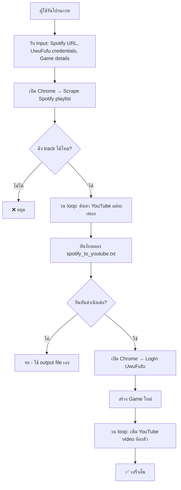

# 🔍 การวิเคราะห์โปรแกรม: Uwufufu-Automator

> [!NOTE]
> โปรแกรมนี้เป็น Python automation script ที่ดึงเพลงจาก Spotify playlist → ค้นหา YouTube links → สร้างเกม UwuFufu และเพิ่ม video โดยอัตโนมัติ

---

## 📋 ภาพรวมของโปรแกรม

| รายการ | รายละเอียด |
|--------|-----------|
| **ภาษา** | Python 3.6+ |
| **ขนาดไฟล์** | 1,121 บรรทัด (ไฟล์เดียว) |
| **Dependencies** | `selenium`, `requests`, `re`, `time`, `random`, `urllib` |
| **วิธีรัน** | CLI (Command Line Interface) |
| **Chrome** | ต้องติดตั้งล่วงหน้า |

### Flow การทำงาน



---

## ✅ ข้อดี

### 1. ความสามารถในการ Fallback ที่หลายชั้น
โปรแกรมมีการ fallback strategy หลายชั้นสำหรับการค้นหา UI elements ทำให้ทนทานต่อการเปลี่ยนแปลง UI ได้ดี

```python
# ตัวอย่าง: ค้นหา Create Game button แบบ 4 ชั้น
# ชั้น 1: CSS Selector ตรง
create_game_links = driver.find_elements(By.CSS_SELECTOR, CREATE_GAME_BUTTON_SELECTOR)
# ชั้น 2: XPATH หาจาก text
xpath = "//*[contains(text(), 'Create Game') or ...]"
# ชั้น 3: JavaScript complex search
driver.execute_script("... document.querySelectorAll('a[href*=\"create-game\"]') ...")
# ชั้น 4: Navigate โดยตรง
driver.get("https://uwufufu.com/create-game")
```

### 2. การใช้ Constants สำหรับ Selectors
มีการแยก hardcoded selectors ออกเป็น global constants ซึ่งง่ายต่อการแก้ไขเมื่อ UI เปลี่ยน

```python
# ✅ ดี - แก้ไขได้ที่เดียว
USERNAME_SELECTOR = "input[name='email']"
PASSWORD_SELECTOR = "input[name='password']"
CHOICES_XPATH = "//span[normalize-space()='Choices']"
VIDEO_ICON_SELECTOR = "svg.lucide-tv-minimal-play"
```

### 3. มีการ Rate Limiting
มีการหน่วงเวลาระหว่าง requests เพื่อไม่ให้ถูก ban จาก YouTube

```python
time.sleep(random.uniform(1.0, 2.5))  # Random delay ป้องกัน bot detection
```

### 4. ดึงข้อมูล Spotify ได้โดยไม่ต้องใช้ API
หลีกเลี่ยงข้อจำกัดของ Spotify API (ต้องขอ access, rate limit) โดยใช้ Selenium scraping โดยตรง

### 5. มีการ Handle Dynamic Content
Spotify ใช้ infinite scroll → โปรแกรม scroll จนกว่าจะโหลดครบตาม expected track count

```python
while len(track_elements) < expected_track_count:
    driver.execute_script("arguments[0].scrollIntoView();", track_elements[-1])
    time.sleep(1.5)
    track_elements = driver.find_elements(By.CSS_SELECTOR, "[data-testid='tracklist-row']")
```

### 6. บันทึก Intermediate Results
บันทึก YouTube links ลงไฟล์ก่อน automation → หากขั้นตอน UwuFufu ล้มเหลว ผู้ใช้ยังมีข้อมูลไว้ใช้เอง

### 7. มี User Confirmation ก่อน Destructive Action
```python
proceed = input("\nReady to proceed with UwuFufu automation? (y/n): ").lower()
if proceed != 'y':
    print("Automation cancelled.")
    return
```

---

## ❌ ข้อเสีย

### 1. 🔴 [วิกฤต] รหัสผ่านแสดงเป็น Plain Text
```python
# ❌ อันตราย - รหัสผ่านแสดงใน terminal แบบ plain text
uwu_password = input("Enter your UwuFufu password: ")
```
ควรใช้ `getpass.getpass()` แทนเพื่อซ่อนการพิมพ์รหัสผ่าน

---

### 2. 🔴 [วิกฤต] ไม่มี Configuration File
ผู้ใช้ต้องพิมพ์ข้อมูลเดิมซ้ำทุกครั้ง ไม่มีการ save credentials หรือ settings ใดๆ

---

### 3. 🟠 [สำคัญ] God Function — `create_and_automate_uwufufu` มีขนาดใหญ่มาก
ฟังก์ชันเดียวทำงานหลายอย่าง: login, navigate, fill form, click buttons, add videos (มากกว่า 700 บรรทัด)

```
create_and_automate_uwufufu() ← รับผิดชอบทุกอย่าง
├── login()
├── navigate_to_create_game()
├── fill_game_form()
├── find_choices_panel()
├── reveal_video_input()
└── add_all_videos()
```

---

### 4. 🟠 [สำคัญ] Bare `except:` ทุกที่
ทำให้ debug ยากมาก — error ถูกกลืนหายไป

```python
# ❌ ไม่ดี
except:
    pass

# ✅ ควรเป็น
except Exception as e:
    logger.warning(f"Could not click element: {e}")
```

---

### 5. 🟠 [สำคัญ] YouTube Search Regex ไม่แม่นยำ
```python
# ❌ regex นี้จับ string อื่นที่ไม่ใช่ video ID ได้ด้วย
video_ids = re.findall(r"watch\?v=(\S{11})", response.text)
```
`\S{11}` จะ match อักขระใดๆ ที่ไม่ใช่ whitespace 11 ตัว รวม `"` หรือ `\` ด้วย ควรใช้ `[A-Za-z0-9_-]{11}` แทน

---

### 6. 🟡 [ปานกลาง] Magic Numbers ไม่ได้อธิบาย
```python
time.sleep(3)    # ← ทำไม 3 วินาที?
time.sleep(0.3)  # ← ทำไม 0.3?
time.sleep(2)    # ← ทำไม 2?
```
ควรมี constant พร้อม comment อธิบาย เช่น `WAIT_AFTER_LOGIN = 2  # seconds for page redirect`

---

### 7. 🟡 [ปานกลาง] สร้าง WebDriver 2 ครั้ง (ไม่ share session)
โปรแกรมเปิด Chrome 2 window แยกกัน:
- ครั้งที่ 1: `get_spotify_playlist_tracks_without_api()` เปิด Chrome scrape Spotify แล้วปิด
- ครั้งที่ 2: `create_and_automate_uwufufu()` เปิด Chrome อีกอัน

ทำให้ใช้ resource มากโดยไม่จำเป็น

---

### 8. 🟡 [ปานกลาง] ไม่มี Logging System
ใช้แต่ `print()` ทำให้ไม่มี log file, ไม่มี timestamp, ไม่มี log level (DEBUG/INFO/WARNING/ERROR)

---

### 9. 🟡 [ปานกลาง] `'title_input' in locals()` — Anti-pattern
```python
# ❌ ไม่ดี
if 'title_input' in locals() and title_input:
    ...
```
การตรวจสอบ variable ด้วย `locals()` เป็น anti-pattern ใน Python ควร initialize ตัวแปรก่อนเป็น `title_input = None`

---

### 10. 🟡 [ปานกลาง] YouTube Search ใช้ฝั่ง Client-side HTML ที่เปลี่ยนแปลงได้
YouTube เปลี่ยน HTML structure บ่อยมาก การ regex scrape บน raw HTML อาจล้มเหลวโดยไม่มีการแจ้งเตือน

---

### 11. 🟢 [เล็กน้อย] ไม่มี `requirements.txt`
ผู้ใช้ต้องอ่าน README เพื่อรู้ว่าต้อง install อะไร ควรมีไฟล์ `requirements.txt`

---

### 12. 🟢 [เล็กน้อย] Output file path เป็น relative path
```python
OUTPUT_FILE = "spotify_to_youtube.txt"  # บันทึกที่ไหน?
```
ไม่ชัดเจนว่าไฟล์จะถูกบันทึกที่ directory ไหน ควรใช้ `pathlib.Path` กำหนดให้ชัดเจน

---

## 🔧 จุดที่ควรปรับปรุง

### Priority 1: ความปลอดภัย
```python
# ❌ ปัจจุบัน
uwu_password = input("Enter your UwuFufu password: ")

# ✅ แก้ไข
import getpass
uwu_password = getpass.getpass("Enter your UwuFufu password: ")
```

---

### Priority 2: แยก God Function ออกเป็น Class/Methods
```python
# ✅ โครงสร้างที่แนะนำ
class UwuFufuAutomator:
    def __init__(self, driver, wait):
        self.driver = driver
        self.wait = wait

    def login(self, username: str, password: str) -> bool: ...
    def navigate_to_create_game(self) -> bool: ...
    def fill_game_details(self, title: str, description: str) -> bool: ...
    def reveal_video_input(self) -> bool: ...
    def add_video(self, url: str, title: str) -> bool: ...
    def add_all_videos(self, youtube_links: list) -> tuple[int, int]: ...
```

---

### Priority 3: เพิ่ม Logging ที่ถูกต้อง
```python
import logging

logging.basicConfig(
    level=logging.INFO,
    format="%(asctime)s [%(levelname)s] %(message)s",
    handlers=[
        logging.FileHandler("automation.log", encoding="utf-8"),
        logging.StreamHandler()
    ]
)
logger = logging.getLogger(__name__)

# แทนที่ print() ทุกที่ด้วย
logger.info("✅ Successfully logged in.")
logger.warning("⚠️ Could not find title input field!")
logger.error("❌ An error occurred: %s", str(e))
```

---

### Priority 4: แก้ไข YouTube regex
```python
# ❌ ปัจจุบัน
video_ids = re.findall(r"watch\?v=(\S{11})", response.text)

# ✅ แก้ไข
video_ids = re.findall(r'"videoId":"([A-Za-z0-9_-]{11})"', response.text)
# หรือ
video_ids = re.findall(r'watch\?v=([A-Za-z0-9_-]{11})', response.text)
```

---

### Priority 5: เพิ่ม `requirements.txt`
```
# requirements.txt
selenium>=4.0.0
requests>=2.28.0
```

---

### Priority 6: ใช้ Named Constants สำหรับ Sleep Times
```python
# ✅ ชัดเจน มี comment อธิบาย
WAIT_AFTER_LOGIN = 2.0          # วินาที รอ redirect หลัง login
WAIT_AFTER_CLICK = 0.3         # วินาที รอ DOM update หลัง click
WAIT_FOR_SPOTIFY_LOAD = 3.0    # วินาที รอ Spotify เสร็จ render
WAIT_BETWEEN_SCROLL = 1.5      # วินาที รอ infinite scroll โหลด
```

---

### Priority 7: เพิ่ม `--headless` mode option
```python
# ✅ ให้ผู้ใช้เลือกได้
import argparse

parser = argparse.ArgumentParser(description="Spotify to UwuFufu Automator")
parser.add_argument("--headless", action="store_true", help="Run browser in headless mode")
args = parser.parse_args()

if args.headless:
    chrome_options.add_argument("--headless=new")
```

---

### Priority 8: แก้ `locals()` Anti-pattern
```python
# ❌ ปัจจุบัน
if 'title_input' in locals() and title_input:
    ...

# ✅ แก้ไข
title_input = None  # initialize ก่อน

# ... หาตัวแปร ...
title_input = driver.find_element(...)

if title_input:
    ...
```

---

### Priority 9: ใช้ `dataclass` สำหรับ Track data
```python
from dataclasses import dataclass
from typing import Optional

@dataclass
class Track:
    name: str
    artist: str
    
    @property
    def search_query(self) -> str:
        return f"{self.name} {self.artist}"

@dataclass
class YoutubeLink:
    title: str
    url: Optional[str]
    
    @property
    def is_valid(self) -> bool:
        return self.url is not None
```

---

### Priority 10: เพิ่ม Retry Decorator
```python
import functools

def retry(max_attempts=3, delay=1.0, exceptions=(Exception,)):
    def decorator(func):
        @functools.wraps(func)
        def wrapper(*args, **kwargs):
            for attempt in range(max_attempts):
                try:
                    return func(*args, **kwargs)
                except exceptions as e:
                    if attempt == max_attempts - 1:
                        raise
                    logger.warning(f"Attempt {attempt+1} failed: {e}. Retrying...")
                    time.sleep(delay)
        return wrapper
    return decorator

@retry(max_attempts=3, delay=2.0)
def search_youtube_without_api(query: str) -> Optional[str]:
    ...
```

---

## 📊 สรุปคะแนนการประเมิน

| ด้าน | คะแนน | หมายเหตุ |
|------|--------|---------|
| **ความสามารถหลัก (Functionality)** | 8/10 | ทำงานได้จริง มี fallback ดี |
| **ความปลอดภัย (Security)** | 3/10 | Password plain text, ไม่มี config file |
| **โครงสร้างโค้ด (Code Structure)** | 4/10 | God function, ไฟล์เดียว 1121 บรรทัด |
| **การรับมือข้อผิดพลาด (Error Handling)** | 5/10 | มี try/except แต่ bare except เยอะ |
| **การบำรุงรักษา (Maintainability)** | 5/10 | Constants ดี แต่ขาด logging/docs |
| **ประสิทธิภาพ (Performance)** | 6/10 | เปิด browser 2 ครั้ง, sleep มาก |
| **การทดสอบ (Testability)** | 2/10 | ไม่มี unit test, ทดสอบแยกไม่ได้ |
| **เอกสาร (Documentation)** | 5/10 | มี README แต่ไม่มี docstring ครบ |

---

## 🗂️ โครงสร้างที่แนะนำ (Refactored)

```
Uwufufu-Automator/
├── src/
│   ├── auto_uwu.py          ← entry point (main only)
│   ├── spotify_scraper.py   ← Spotify scraping logic
│   ├── youtube_searcher.py  ← YouTube search logic
│   ├── uwufufu_automator.py ← UwuFufu automation (class-based)
│   ├── models.py            ← Track, YoutubeLink dataclasses
│   └── config.py            ← Constants & settings
├── tests/
│   ├── test_spotify_scraper.py
│   ├── test_youtube_searcher.py
│   └── test_uwufufu_automator.py
├── requirements.txt
├── requirements-dev.txt     ← pytest, etc.
└── README.md
```

---

> [!TIP]
> จุดที่ควรแก้ก่อนเลยคือ **Priority 1 (Password Security)** และ **Priority 2 (แยก God Function)** เพราะส่งผลต่อความปลอดภัยและความยากในการดูแลโค้ดในระยะยาวมากที่สุด
